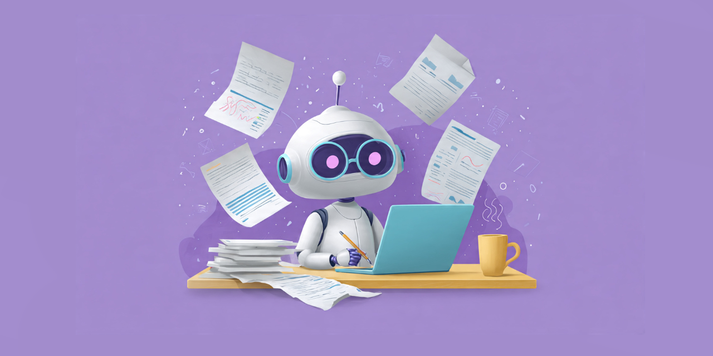

# Blog Content Powered by AI

 

A simple **Multi-Model AI Pipeline** to write and publish blog article in bulk volume.

- Blog Frontend Template👉 [https://github.com/DeveshRx/Into-Deep-Ocean-AI-Blog](https://github.com/DeveshRx/Into-Deep-Ocean-AI-Blog)

- AI Workflow and Pipeline👉 [https://github.com/DeveshRx/AI-Blog-Workflow](https://github.com/DeveshRx/AI-Blog-Workflow)

# Goal
Empower Bloggers, SEO Hackers and Small/Medium business to create content in bulk volume.

# Tech Stack

 Python, LangChain, LM Studio, ComfyUI

# Features
- use any LLM Model and Image model
- Work 100% offline on-devicew without internet
- Works on Consumer Hardware and GPU
- supports uncencored LLM Models and Image Models
- easy to customise as per your needs
- Generate Thumbnail Image for blog
- SEO Optimise with right prompt
- Customisable Prompts and System Prompts
- Customasible Blog Schema for wide variety of use cases
- Blog Articles are generate in ``.mdx`` file format. Easy to process in bulk volume.
- All Thumbnail images are web optimised with ``.webp`` image format.
- Ready-to-Deploy Frontend website is included.

# How it Works ?
- Decide and Create a list of topics to write blog article and save that list in ``topics.csv`` file under ``/data`` folder.

- Write a System prompt in ``system_prompt.txt`` file and write a Prompt in ``prompt.txt`` file 

- Install LM Studio and ComfyUI along with models which you desire to use

- Run the Script ``app.py`` file

 Blog articles will generate in ``.mdx`` file format along with it's thumbnail image in ``.webp`` file format.

 All the articles will be saved under ``/output`` folder.

- Copy-Paste all the blog files from ``/output`` folder to the ``content`` folder of your [Website](https://github.com/DeveshRx/Into-Deep-Ocean-AI-Blog).
- Voila !! blog articles are generated and ready to publish.

